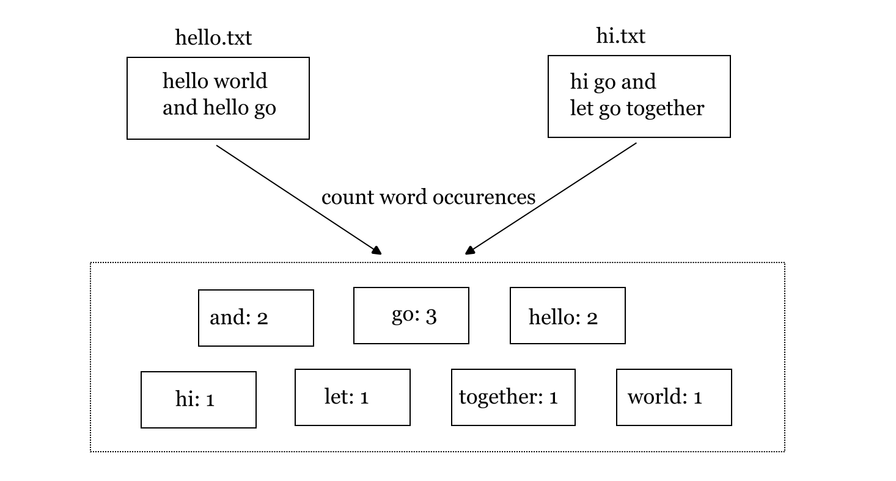
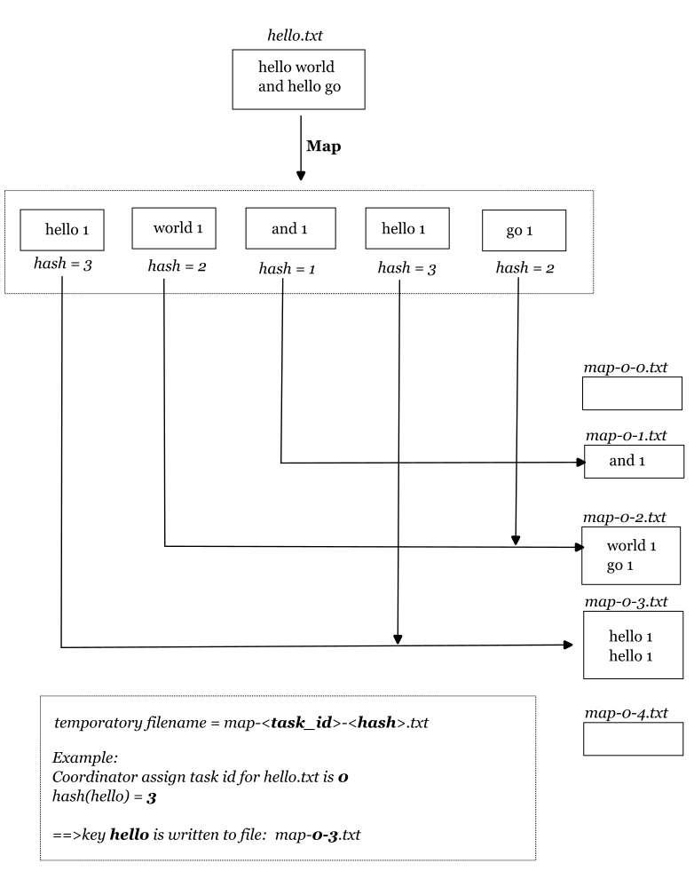
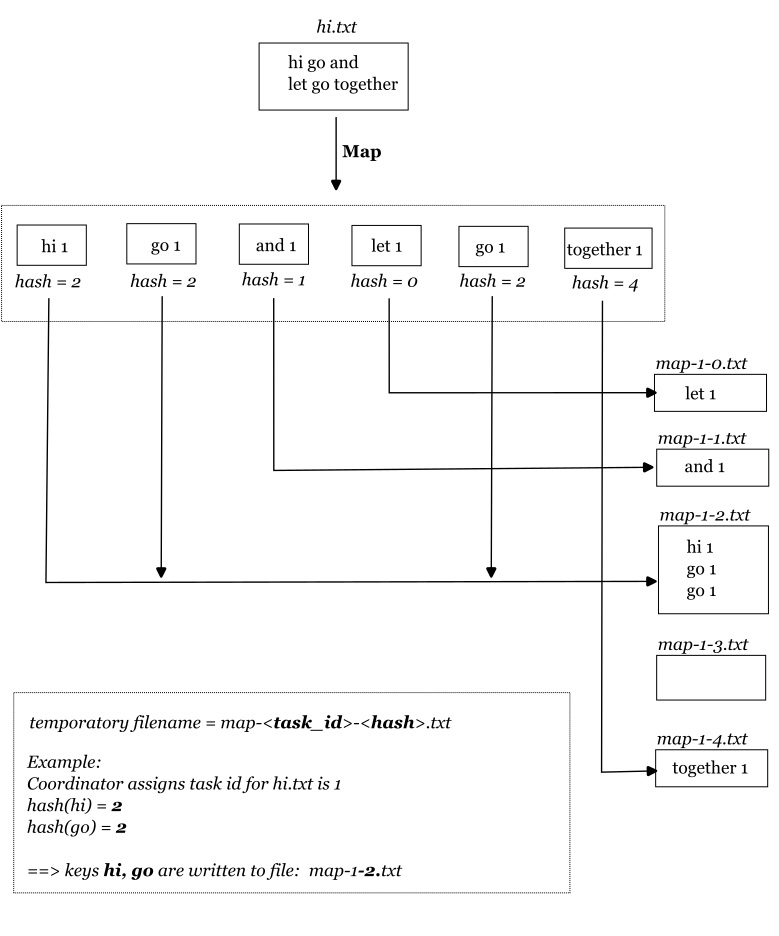

# Distributed Word Count
## 1. Introduction
The MapReduce model is particularly suited for handling tasks that can be divided into two main phases: the Map phase and the Reduce phase.  

Distributed Word Count is a classic example often used to illustrate the MapReduce programming model for processing and analyzing large datasets. In this scenario, the goal is to count the occurrences of each word in a given collection of text files.



In the beginning, our focus will be on understanding the implementation of a word count program using a sequential approach during session 2. Subsequently, during session 3, we will delve into the exploration of parallel implementation using the MapReduce model.

## 2. Sequential Solution
## 2.1 Description
In the below example, we will count occurences of words in two files `hello.txt` and `hi.txt` using sequential solution. 

 

### 2.1.1. Map Phase
The map function takes each input file and emits key-value pairs. The key is usually a word, and the value is 1.
```
              hello world and hello go
                          |
                          v
                    Map function
                          |
                          v
  {hello 1} {world 1} {and 1} {hello 1} {go 1}
```
### 2.1.2. Shuffle & Sort Phase
- The emitted key-value pairs from Map function are sorted and grouped based on their keys. All occurrences of a specific word are brought together.

```
{hello 1} {world 1} {and 1} {hello 1} {go 1}
                        |
                        v
                    Sort by key
                        |
                        v
{and 1} {go 1} {hello 1} {hello 1} {world 1}
                        |
                        v
                    Group by key
                        |
                        v
            _________________________
            |   key   | values      |
            |:-------:|:-----------:|
            |   and   |   [1]       |
            |   go    |   [1]       |
            |  hello  |   [1, 1]    |
            |  world  |   [1]       |

```

### 2.1.3. Reduce Phase
- The reduce function produces a collection of key-value pairs, in which each key corresponds to a distinct word, and its associated value represents the cumulative count of that word across the entire input dataset.
```
|   key   | values      |     Reduce    |
|:-------:|:-----------:|:-------------:|
|   and   |     [1]     |       1       |
|   go    |     [1]     |       1       |
|  hello  |   [1, 1]    |       2       |
|  world  |     [1]     |       1       |
```

## 2.2. Implementation
### 2.2.1. `wc.go`
File `wc.go` provides Map and Reduce functions which support for word counting.

```go
package main

import "unicode"
import "strings"
import "strconv"

type KeyValue struct {
	Key   string
	Value string
}

// for sorting by key.
type ByKey []KeyValue

// for sorting by key.
func (a ByKey) Len() int           { return len(a) }
func (a ByKey) Swap(i, j int)      { a[i], a[j] = a[j], a[i] }
func (a ByKey) Less(i, j int) bool { return a[i].Key < a[j].Key }

/*
	The Map function tokenizes the text, separates it into words, 
	and emits key-value pairs.The key is the word, 
	and the value is a count of 1 for each occurrence of the word.

	Samples:
	Map("hello.txt", "hello world and hello go")
 	==> [{hello 1} {world 1} {and 1} {hello 1} {go 1}]

 	Map("hi.txt", "hello go")
 	==> [{hello 1} {go 1}]
*/
func Map(filename string, contents string) [] KeyValue {
	// function to detect word separators.
	ff := func(r rune) bool { return !unicode.IsLetter(r) }

	// split contents into an array of words.
	words := strings.FieldsFunc(contents, ff)

	kva := [] KeyValue{}
	for _, w := range words {
		kv := KeyValue{w, "1"}
		kva = append(kva, kv)
	}
	return kva
}


/*
	Reduce function receives the list of counts associated with key.
	The Reduce function sums up these counts to compute the total occurrences of the word.

	Samples:
	Reduce("hello", []string{"1", "1"})		=> 2
	Reduce("hi", ["1"])       => 1
*/
func Reduce(key string, counts []string) string {
	// return the number of occurrences of this word.
	return strconv.Itoa(len(counts))
}
```

### 2.2.2. `sequential.go`
In file `sequential.go`, we implement sequential logic. The program receives a list of input files, compute word occurences, and save to file `output.txt`.

```go
package main

import "fmt"
import "os"
import "io/ioutil"
import "sort"

func main() {
	if len(os.Args) < 2 {
		fmt.Fprintf(os.Stderr, "Usage: mrsequential <filename_1> [filename_2]...\n")
		os.Exit(1)
	}

	fmt.Println("Phase Map")

	intermediate := [] KeyValue{}
	for _, filename := range os.Args[1:] {
		file, _ := os.Open(filename)
		content, _ := ioutil.ReadAll(file)
		file.Close()
		
		kva := Map(filename, string(content))
		fmt.Println("Map", filename, "=>", kva)

		intermediate = append(intermediate, kva...)
		fmt.Println("intermediate:", intermediate)
	}

	fmt.Println("\nPhase Suffle and Sort")

	sort.Sort(ByKey(intermediate))
	fmt.Println("sorted intermediate:", intermediate)

	oname := "output.txt"
	ofile, _ := os.Create(oname)

	fmt.Println("\nPhase Reduce")
	i := 0
	for i < len(intermediate) {
		j := i + 1
		for j < len(intermediate) && intermediate[j].Key == intermediate[i].Key {
			j++
		}
		values := []string{}
		for k := i; k < j; k++ {
			values = append(values, intermediate[k].Value)
		}

		count := Reduce(intermediate[i].Key, values)
		fmt.Println("Reduce", intermediate[i].Key, "=>", count)

		// Save reduce result to output file
		fmt.Fprintf(ofile, "%v %v\n", intermediate[i].Key, count)

		i = j
	}

	ofile.Close()
	fmt.Println("\nOutput saved to output.txt")
}
```

## 2.3. Testcase
### 2.3.1. Input
```zsh
echo "hello world and hello go" > hello.txt
echo "hi go and let go together" > hi.txt
```

### 2.3.2. Run
```zsh
go run wc.go sequential.go hello.txt hi.txt
```

### 2.3.3. Output
Output is saved in `output.txt`.
```text
and 2
go 3
hello 2
hi 1
let 1
together 1
world 1
```

## 3. **MapReduce Solution**
## 3.1. Description
In a MapReduce solution, the Coordinator handles task distribution, progress monitoring, and data management, while Workers execute tasks, process data, and communicate their results back to the Coordinator.

### 3.1.1 Map Phase
**Coordinator**
- Creates map tasks for files `hello.txt` and `hi.txt`. Task id for `hello.txt` is 0, for `hi.txt` is 1.
- Wait for task requests from Workers.

```
     ┌────────┐          ┌────────┐           ┌───────────┐                        
     │Worker_1│          │Worker_2│           │Coordinator│                        
     └───┬────┘          └───┬────┘           └─────┬─────┘                        
         │                   │                      │────┐                         
         │                   │                      │    │ create MapTask hello.txt
         │                   │                      │<───┘                         
         │                   │                      │                              
         │                   │                      │────┐                         
         │                   │                      │    │ create MapTask hi.txt   
         │                   │                      │<───┘                         
         │                   │                      │                              
         │               request task               │                              
         │ ─────────────────────────────────────────>                              
         │                   │                      │                              
         │                   │     request task     │                              
         │                   │ ─────────────────────>                              
         │                   │                      │                              
         │         assign MapTask hello.txt         │                              
         │ <─────────────────────────────────────────                              
         │                   │                      │                              
         │                   │ assign MapTask hi.txt│                              
         │                   │ <─────────────────────                              
     ┌───┴────┐          ┌───┴────┐           ┌─────┴─────┐                        
     │Worker_1│          │Worker_2│           │Coordinator│                        
     └────────┘          └────────┘           └───────────┘        
```

**Worker_1**  
- Execute the Map tasks on `hello.txt`.
- Create 5 temporary files, namely `map-0-0.txt`, `map-0-1.txt`, `map-0-2.txt`, `map-0-3.txt`, and `map-0-4.txt`, to hold the output of the Map function. These files are formatted as `map-X-Y.txt`, where X represents the task ID and Y is the hash value of key (word). The number of temporatory files is configurable. 
- For example, let's consider the task for the file `hello.txt`, which is assigned the **task with id 0**. Now, suppose the **hash value** for the key "world" is **2**. In this scenario, the key-value pair associated with the key "world" will be recorded in the file named **map-0-2.txt**.




**Worker_2**  
- Execute the Map tasks on `hello.txt`.
- Create 5 temporary files, namely `map-1-0.txt`, `map-1-1.txt`, `map-1-2.txt`, `map-1-3.txt`, and `map-1-4.txt`, to hold the output of the Map function.
- Write the key-value pairs to the corresponding files.



**Workers notify Coordinator about completed tasks**  
Once tasks are finished, Worker_1 and Worker_2 will notify the Coordinator.
In case there are other tasks still pending in the Coordinator's queue, it will prompt the workers to request new tasks.
```
     ┌──────┐            ┌───────────┐
     │Worker│            │Coordinator│
     └──┬───┘            └─────┬─────┘
        │    task completed    │      
        │ ─────────────────────>      
        │                      │      
        │ there remaining tasks│      
        │ <─────────────────────      
        │                      │      
        │     task request     │      
        │ ─────────────────────>      
     ┌──┴───┐            ┌─────┴─────┐
     │Worker│            │Coordinator│
     └──────┘            └───────────┘
```


### 3.1.2 Reduce Phase

**Coordinator:**  
- Generate five reduce tasks, each tasked with processing files produced by map functions. These files are labeled in the format `map-X-Y.txt`, with Y representing the *hash number*. Each reduce task will manage a set of files that share the same Y value. To illustrate, files such as `map-0-4.txt`, `map-1-4.txt` and `map-2-4.txt` would all fall within the same group distinguished by `Y=4`.
```
| reduce task | files                        |
|-------------|------------------------------|
| 0           | map-0-0.txt, map-1-0.txt     |
| 1           | map-0-1.txt, map-1-1.txt     |
| 2           | map-0-2.txt, map-1-2.txt     |
| 3           | map-0-3.txt, map-1-3.txt     |
| 4           | map-0-4.txt, map-1-4.txt     |
```

- Wait for task requests from Workers.
```
     ┌────────┐                ┌───────────┐                 ┌────────┐
     │Worker_1│                │Coordinator│                 │Worker_2│
     └───┬────┘                └─────┬─────┘                 └───┬────┘
         │                           │────┐                      │     
         │                           │    │ create reduce tasks  │     
         │                           │<───┘                      │     
         │                           │                           │     
         │        request task       │                           │     
         │ ──────────────────────────>                           │     
         │                           │                           │     
         │    assign reduce task 0   │                           │     
         │ <──────────────────────────                           │     
         │                           │                           │     
         │       completed task      │                           │     
         │ ──────────────────────────>                           │     
         │                           │                           │     
         │ there still remaining task│                           │     
         │ <──────────────────────────                           │     
         │                           │                           │     
         │        request task       │                           │     
         │ ──────────────────────────>                           │     
         │                           │                           │     
         │ assign another reduce task│                           │     
         │ <──────────────────────────                           │     
         │                           │                           │     
         │                           │        request task       │     
         │                           │ <──────────────────────────     
         │                           │                           │     
         │                           │    assign reduce task 1   │     
         │                           │ ──────────────────────────>     
         │                           │                           │     
         │                           │       completed task      │     
         │                           │ <──────────────────────────     
         │                           │                           │     
         │                           │ there still remaining task│     
         │                           │ ──────────────────────────>     
         │                           │                           │     
         │                           │        request task       │     
         │                           │ <──────────────────────────     
         │                           │                           │     
         │                           │ assign another reduce task│     
         │                           │ ──────────────────────────>     
     ┌───┴────┐                ┌─────┴─────┐                 ┌───┴────┐
     │Worker_1│                │Coordinator│                 │Worker_2│
     └────────┘                └───────────┘                 └────────┘
```

**Workers:**  
Perform the reduce tasks and record the output into files formatted as `output-Y.txt`, where Y represents the hash number. Worker_1 and Worker_2 will execute these tasks in parallel.


After all tasks are completed, the Coordinator will also notify the workers to cease requesting tasks.
```
     ┌──────┐                ┌───────────┐
     │Worker│                │Coordinator│
     └──┬───┘                └─────┬─────┘
        │      task completed      │      
        │ ─────────────────────────>      
        │                          │      
        │       no more task       │      
        │ <─────────────────────────      
        │                          │      
        │────┐                            
        │    │ cease requesting task      
        │<───┘                            
     ┌──┴───┐                ┌─────┴─────┐
     │Worker│                │Coordinator│
     └──────┘                └───────────┘
```
### 3.1.3 Result Phase
Once Workers complete their respective Reduce tasks, the Coordinator gathers all the Reduce outputs and merge them into a single file.


## 2.2 Implementation
### 

