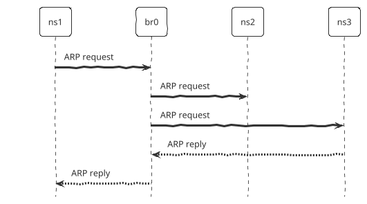

# 1. Introduction
The Address Resolution Protocol (ARP) resolves **IP addresses** to **MAC addresses** in a local network, ensuring that data is sent to the correct physical device.  

How ARP works:  

- **ARP Request**: When Device A wants to talk to another device (Device B) on the same network but only knows Device B's IP address, Device A sends out an ARP request. This broadcast message asks, "Who has IP address X? Please send me your MAC address."   
- **Broadcasting the Request**: This ARP request is sent out to all devices on the local network. It includes the IP address Device A is trying to find, as well as Device A’s own MAC and IP addresses.  
- **ARP Response**: Every device on the network sees the request, but only Device B (the one with the matching IP address) responds. Device B sends a direct reply to Device A, providing its MAC address.  
- **Updating the ARP Cache**: Once Device A receives Device B’s MAC address, it updates its ARP cache with this new IP-to-MAC mapping. This helps Device A quickly communicate with Device B in the future without needing to send another ARP request.  
- **Communication**: With the MAC address in hand, Device A can now send data directly to Device B using the MAC address, allowing smooth and efficient communication.  

Command to send an ARP request:
```sh
  
$ arping <ip_address>
  
```

# 2. Labs
## 2.1. Setup Virtual Network
- Create namespaces: ns1, ns2, ns3
- Create virtual bridge: br0
- Connect the namespaces to the virtual bridge.

<script type="module">
    import mermaid from 'https://cdn.jsdelivr.net/npm/mermaid@11/dist/mermaid.esm.min.mjs';
    mermaid.initialize({
        look: 'handDrawn',
        theme: 'neutral',
    });
</script>

<pre class="mermaid">
flowchart TD
    subgraph ns1
        veth1
    end

    subgraph ns2
        veth2
    end   

    subgraph ns3
        veth3
    end

    subgraph br0
        veth1-br
        veth2-br
        veth3-br
    end

    veth1 <---> veth1-br
    veth2 <---> veth2-br       
    veth3 <---> veth3-br       
</pre>

```sh
  
# create namespaces
$ ip netns add ns1
$ ip netns add ns2
$ ip netns add ns3

# create virtual bridge
$ ip link add br0 type bridge
$ ip link set br0 up

# connect namespace 1 to the bridge
$ ip link add veth1 type veth peer name veth1-br
$ ip link set veth1 netns ns1
$ ip netns exec ns1 ip link set veth1 up
$ ip link set veth1-br master br0
$ ip link set veth1-br up
  
# connect namespace 2 to the bridge
$ ip link add veth2 type veth peer name veth2-br
$ ip link set veth2 netns ns2
$ ip netns exec ns2 ip link set veth2 up
$ ip link set veth2-br master br0
$ ip link set veth2-br up

# connect namespace 3 to the bridge
$ ip link add veth3 type veth peer name veth3-br
$ ip link set veth3 netns ns3
$ ip netns exec ns3 ip link set veth3 up
$ ip link set veth3-br master br0
$ ip link set veth3-br up

# show learned mac address of the bridge
$ brctl showmacs br0

# set IP addresses
$ ip netns exec ns1 ip addr add 192.168.0.10/24 dev veth1
$ ip netns exec ns2 ip addr add 192.168.0.20/24 dev veth2
$ ip netns exec ns3 ip addr add 192.168.0.30/24 dev veth3
  
```

## 2.2. Send ARP Requests
- From the ns1 namespace, send an ARP request to determine the MAC address of ns3 using its IP address.



```sh
  
$ nsenter --net=/var/run/netns/ns1 bash

$ arping -c 1 192.168.0.30
  
```

- Use `tcpdump` to monitor ARP packets.
```sh
  
$ tcpdump -i br0 arp
  
```


## 2.3. Manipulate ARP Cache
```sh
  
# enter namespace ns1
$ nsenter --net=/var/run/netns/ns1 bash

$ ping -c 1 192.168.0.30

# show arp cache
$ arp -n

# remove an entry from cache.
$ sudo arp --delete 192.168.0.30
    
```

# References
- https://man7.org/linux/man-pages/man8/arp.8.html
- https://man7.org/linux/man-pages/man8/arping.8.html
- https://linux.die.net/man/8/ping