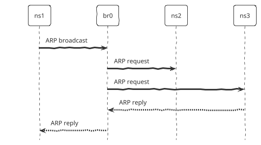

# 1. Introduction
The Address Resolution Protocol (ARP) resolves **IP addresses** to **MAC addresses** in a local network, ensuring that data is sent to the correct physical device.  

Send an ARP request:
```sh
  
$ arping <ip_address>
  
```

Modify ARP cache:
```sh
  
$ arp [--set/--delete] <ip_address>
  
```
# 2. Labs
## 2.1. Setup
- Create namespaces: `ns1`, `ns2`, `ns3`.
- Create virtual bridge: `br0`.
- Connect `ns1`, `ns2`, `ns3` to `br0`.

<script type="module">
    import mermaid from 'https://cdn.jsdelivr.net/npm/mermaid@11/dist/mermaid.esm.min.mjs';
    mermaid.initialize({
        look: 'handDrawn',
        theme: 'neutral',
    });
</script>

<pre class="mermaid">
flowchart TD
    subgraph ns1
        veth1
    end

    subgraph ns2
        veth2
    end   

    subgraph ns3
        veth3
    end

    subgraph br0
        veth1-br
        veth2-br
        veth3-br
    end

    veth1 <---> veth1-br
    veth2 <---> veth2-br       
    veth3 <---> veth3-br       
</pre>

```sh
  
# create namespaces
$ ip netns add ns1
$ ip netns add ns2
$ ip netns add ns3

# create virtual bridge
$ ip link add br0 type bridge
$ ip link set br0 up

# connect namespace 1 to the bridge
$ ip link add veth1 type veth peer name veth1-br
$ ip link set veth1 netns ns1
$ ip link set veth1-br master br0
$ ip link set veth1-br up
  
# connect namespace 2 to the bridge
$ ip link add veth2 type veth peer name veth2-br
$ ip link set veth2 netns ns2
$ ip link set veth2-br master br0
$ ip link set veth2-br up

# connect namespace 3 to the bridge
$ ip link add veth3 type veth peer name veth3-br
$ ip link set veth3 netns ns3
$ ip link set veth3-br master br0
$ ip link set veth3-br up

# show learned mac address of the bridge
$ brctl showmacs br0

# set IP addresses
$ ip netns exec ns1 ip addr add 192.168.0.10/24 dev veth1
$ ip netns exec ns1 ip link set veth1 up

$ ip netns exec ns2 ip addr add 192.168.0.20/24 dev veth2
$ ip netns exec ns2 ip link set veth2 up

$ ip netns exec ns3 ip addr add 192.168.0.30/24 dev veth3
$ ip netns exec ns3 ip link set veth3 up
  
```

## 2.2. Capture ARP Packets
Capture the ARP packets.
```sh
  
$ tshark -P -i br0 -f arp -w arp.pcap
  
```

From `ns1`, send an ARP request to find MAC of `ns3`.
```sh
  
$ ip netns exec ns1 arping -c 1 192.168.0.30
  
```

## 2.3. Analyze ARP Packets
Read the ARP packets.
```sh
  
$ tshark -r arp.pcap
  
```

Output.
```sh
  
1 0.000000000 fa:38:6b:d1:87:f1 → Broadcast             ARP 58      Who has 192.168.0.30? Tell 192.168.0.10
2 0.000045275 92:58:f4:c7:45:b2 → fa:38:6b:d1:87:f1     ARP 42      192.168.0.30 is at 92:58:f4:c7:45:b2
  
```

How `ns1` finds MAC of `ns3`.


- `ns1` sends an ARP broadcast to `br0`.
- `br0` forwards the request to `ns2`, `ns3`.
- The IP address of `ns2` is different from the IP address in the request. So, it ignores.
- The IP address of `ns3` matches the IP address specified in the request. So, it replies its MAC to `ns1`.

 

## 2.4. Manipulate ARP Cache
ARP cache is a table stored in the memory of a device that maps IP addresses to MAC addresses. It stores the results of recent ARP requests to reduce repeated requests.

```sh
  
# enter namespace ns1
$ nsenter --net=/var/run/netns/ns1 bash

$ ping -c 1 192.168.0.30

# show arp cache
$ arp -n

# remove an entry from cache.
$ arp --delete 192.168.0.30
    
```

# References
- https://man7.org/linux/man-pages/man8/arp.8.html
- https://man7.org/linux/man-pages/man8/arping.8.html
- https://linux.die.net/man/8/ping